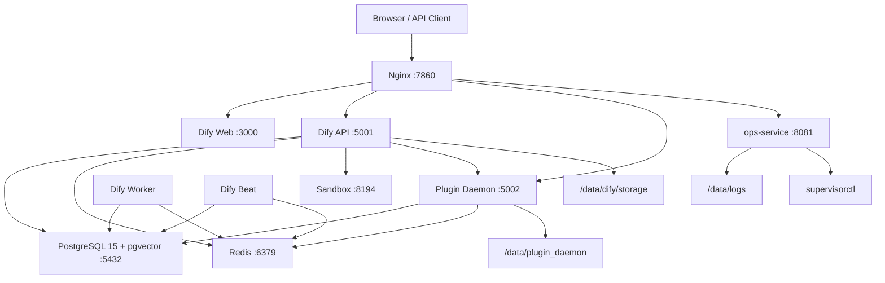
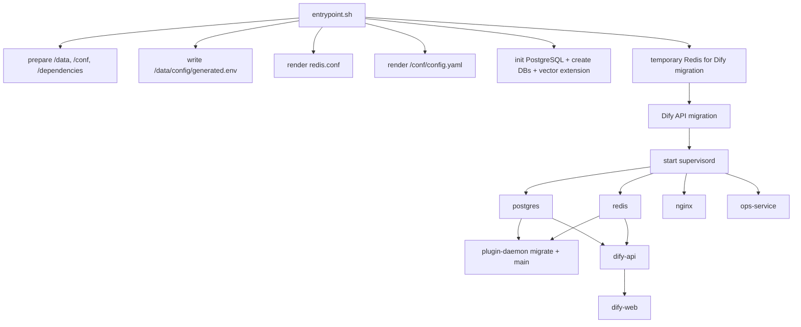

# Architecture

本文档描述当前单容器 Dify Demo 的组件拓扑、请求路由、启动依赖和数据流。

## 总体拓扑



## 容器内进程

所有长期运行进程由 `supervisord` 管理：

| program | 端口 | 作用 | 日志 |
| --- | --- | --- | --- |
| `postgres` | `127.0.0.1:5432` | Dify 主库、plugin 库、pgvector | `/data/logs/postgres.log`, `/data/logs/postgres.err` |
| `redis` | `127.0.0.1:6379` | Celery broker/cache/plugin 协调 | `/data/logs/redis.log`, `/data/logs/redis.err` |
| `plugin-daemon` | `0.0.0.0:5002`, `0.0.0.0:5003` | Dify plugin runtime 和 remote install | `/data/logs/plugin-daemon.log`, `/data/logs/plugin-daemon.err` |
| `sandbox` | `127.0.0.1:8194` | Code execution sandbox | stdout/stderr |
| `dify-api` | `0.0.0.0:5001` | Dify API server | `/data/logs/dify-api.log`, `/data/logs/dify-api.err` |
| `dify-worker` | none | Celery worker | `/data/logs/dify-worker.log`, `/data/logs/dify-worker.err` |
| `dify-beat` | none | Celery beat scheduler | `/data/logs/dify-beat.log`, `/data/logs/dify-beat.err` |
| `dify-web` | `0.0.0.0:3000` | Next.js Web UI | stdout/stderr |
| `ops-service` | `127.0.0.1:8081` | 只读诊断服务 | `/data/logs/ops-service.log`, `/data/logs/ops-service.err` |
| `nginx` | `0.0.0.0:7860` | 外部单入口反向代理 | `/data/logs/nginx.log`, stderr |

## Nginx 路由

`docker/nginx.conf` 是静态配置，当前监听固定 `7860`。`docker/dify.env.runtime` 中保留了 `NGINX_PORT` 和 `NGINX_CLIENT_MAX_BODY_SIZE` 默认变量，但 Nginx 配置没有模板渲染；如果要修改监听端口或 body size，需要同步修改 `nginx.conf` 和 Hugging Face `app_port`。

| path | upstream | 说明 |
| --- | --- | --- |
| `/nginx-health` | Nginx 本地返回 | Nginx 存活探针 |
| `/healthz` | `ops-service /healthz` | 综合健康探针 |
| `/_ops` | redirect `/_ops/` | 保留 query string |
| `/_ops/` | `127.0.0.1:8081` | 只读运维诊断入口 |
| `/console/api` | `127.0.0.1:5001` | Dify console API |
| `/api` | `127.0.0.1:5001` | Dify API |
| `/v1` | `127.0.0.1:5001` | OpenAPI style endpoint |
| `/files` | `127.0.0.1:5001` | 文件访问 |
| `/mcp` | `127.0.0.1:5001` | MCP endpoint |
| `/triggers` | `127.0.0.1:5001` | Trigger endpoint |
| `/socket.io/` | `127.0.0.1:5001` | WebSocket / socket.io |
| `/e/` | `127.0.0.1:5002` | Plugin endpoint hook |
| `/explore` | `127.0.0.1:3000` | Dify Web |
| `/` | `127.0.0.1:3000` | Dify Web fallback |

`/e/` 会设置 `Dify-Hook-Url`，把外部完整 hook URL 传给 Plugin Daemon。

## 启动依赖



长期运行阶段的依赖由 `docker/wait-for-core` 控制：

- `plugin-daemon` 等待 `postgres` 和 `redis`。
- `dify-api`、`dify-worker`、`dify-beat` 等待 `postgres` 和 `redis`。
- `dify-web` 等待 Dify API `/health`。

## 数据库布局

`entrypoint.sh` 会创建两个 PostgreSQL database：

| database | 默认值 | 用途 |
| --- | --- | --- |
| `DB_DATABASE` | `dify` | Dify API 主库和 pgvector |
| `DB_PLUGIN_DATABASE` | `dify_plugin` | Plugin Daemon 数据库 |

两个库都会尝试创建 `vector` extension。

Dify API 迁移在 supervisord 启动前执行：

```bash
cd /app/api && MODE=migration MIGRATION_ENABLED=true ./docker/entrypoint.sh
```

Plugin Daemon 迁移在其 supervisor program 启动时执行：

```bash
/opt/dify/plugin-daemon/commandline migrate && exec /opt/dify/plugin-daemon/main
```

## 持久化目录

| path | 内容 |
| --- | --- |
| `/data/postgres` | PostgreSQL data directory |
| `/data/redis` | Redis appendonly / dump 数据 |
| `/data/dify/storage` | Dify 文件存储 |
| `/data/plugin_daemon` | Plugin working path、plugin 包、assets |
| `/data/config/generated.env` | 自动生成或持久化的 runtime secrets |
| `/data/logs` | supervisor 和服务日志 |
| `/data/run` | pid、socket、临时配置 |
| `/data/run/nginx/*` | Nginx temp path |
| `/conf/config.yaml` | Sandbox runtime config |
| `/dependencies` | Sandbox 依赖文件占位 |

Hugging Face Space 如果没有启用 Persistent Storage，`/data` 里的数据库、登录状态、插件、上传文件和生成密钥都会在重启后丢失。

## 只读运维面

`ops-service` 不直接暴露公网端口，只绑定 `127.0.0.1:8081`，由 Nginx 代理到 `/_ops/`。它的能力包括：

- HTTP/TCP/command 健康检查。
- `supervisorctl status` 解析。
- 非敏感配置摘要。
- secret 是否存在的布尔摘要。
- 白名单日志 tail。
- 近期错误模式匹配。

它不提供：

- 重启服务。
- 修改配置。
- 执行 SQL。
- 删除数据。
- 写入 secret。

这些写操作需要单独的管理面板设计、审计和更强鉴权。
