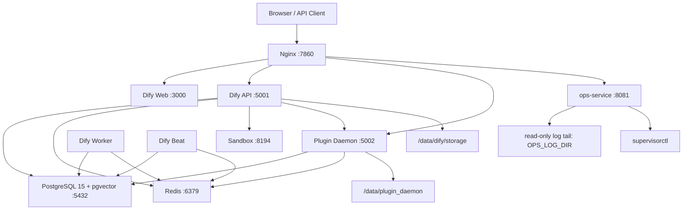
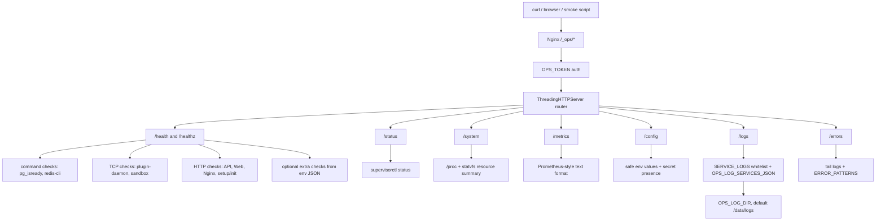
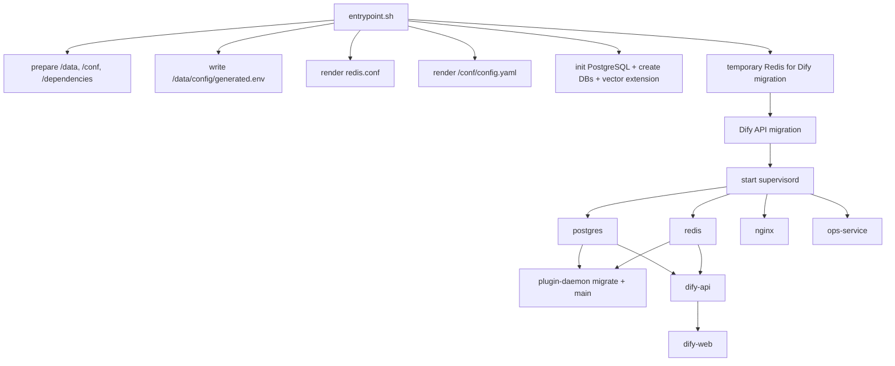

# Architecture

本文档描述当前单容器 Dify Demo 的组件拓扑、请求路由、启动依赖和数据流。

## 总体拓扑



## OPS 内部架构

`ops-service` 是一个无持久化状态的只读诊断层。它不写业务数据，也不依赖自己的 `/data` 落盘日志；自身 stdout/stderr 交给容器平台日志系统，`/_ops/logs` 只按白名单读取其他服务日志。



## 容器内进程

所有长期运行进程由 `supervisord` 管理：

| program | 端口 | 作用 | 日志 |
| --- | --- | --- | --- |
| `postgres` | `127.0.0.1:5432` | Dify 主库、plugin 库、pgvector | `/data/logs/postgres.log`, `/data/logs/postgres.err` |
| `redis` | `127.0.0.1:6379` | Celery broker/cache/plugin 协调 | `/data/logs/redis.log`, `/data/logs/redis.err` |
| `postgres-backup` | none | bucket-lite 下定期 `pg_dumpall` 到 `/persist/postgres-backups/latest.sql.gz` | `/data/logs/postgres-backup.log`, `/data/logs/postgres-backup.err` |
| `plugin-daemon` | `0.0.0.0:5002`, `0.0.0.0:5003` | Dify plugin runtime 和 remote install | `/data/logs/plugin-daemon.log`, `/data/logs/plugin-daemon.err` |
| `sandbox` | `127.0.0.1:8194` | Code execution sandbox | stdout/stderr |
| `dify-api` | `0.0.0.0:5001` | Dify API server | `/data/logs/dify-api.log`, `/data/logs/dify-api.err` |
| `dify-worker` | none | Celery worker | `/data/logs/dify-worker.log`, `/data/logs/dify-worker.err` |
| `dify-beat` | none | Celery beat scheduler | `/data/logs/dify-beat.log`, `/data/logs/dify-beat.err` |
| `dify-web` | `0.0.0.0:3000` | Next.js Web UI | stdout/stderr |
| `ops-service` | `127.0.0.1:8081` | 只读诊断服务 | stdout/stderr |
| `nginx` | `0.0.0.0:7860` | 外部单入口反向代理 | `/data/logs/nginx.log`, stderr |

## Nginx 路由

`docker/nginx.conf` 是静态配置，当前监听固定 `7860`。`docker/dify.env.runtime` 中保留了 `NGINX_PORT` 和 `NGINX_CLIENT_MAX_BODY_SIZE` 默认变量，但 Nginx 配置没有模板渲染；如果要修改监听端口或 body size，需要同步修改 `nginx.conf` 和 Hugging Face `app_port`。

| path | upstream | 说明 |
| --- | --- | --- |
| `/nginx-health` | Nginx 本地返回 | Nginx 存活探针 |
| `/healthz` | `ops-service /healthz` | 综合健康探针 |
| `/_ops` | redirect `/_ops/` | 保留 query string |
| `/_ops/` | `127.0.0.1:8081` | 只读运维诊断入口 |
| `/_admin/` | Nginx local 404 | Admin 默认关闭，避免落到 Web 默认路由 |
| `/console/api` | `127.0.0.1:5001` | Dify console API |
| `/api` | `127.0.0.1:5001` | Dify API |
| `/v1` | `127.0.0.1:5001` | OpenAPI style endpoint |
| `/files` | `127.0.0.1:5001` | 文件访问 |
| `/mcp` | `127.0.0.1:5001` | MCP endpoint |
| `/triggers` | `127.0.0.1:5001` | Trigger endpoint |
| `/socket.io/` | `127.0.0.1:5001` | WebSocket / socket.io |
| `/e/` | `127.0.0.1:5002` | Plugin endpoint hook |
| `/explore` | `127.0.0.1:3000` | Dify Web |
| `/` | `127.0.0.1:3000` | Dify Web fallback |

`/e/` 会设置 `Dify-Hook-Url`，把外部完整 hook URL 传给 Plugin Daemon。

## 启动依赖



长期运行阶段的依赖由 `docker/wait-for-core` 控制：

- `plugin-daemon` 等待 `postgres` 和 `redis`。
- `dify-api`、`dify-worker`、`dify-beat` 等待 `postgres` 和 `redis`。
- `dify-web` 等待 Dify API `/health`。

## 数据库布局

`entrypoint.sh` 会创建两个 PostgreSQL database：

| database | 默认值 | 用途 |
| --- | --- | --- |
| `DB_DATABASE` | `dify` | Dify API 主库和 pgvector |
| `DB_PLUGIN_DATABASE` | `dify_plugin` | Plugin Daemon 数据库 |

两个库都会尝试创建 `vector` extension。

Dify API 迁移在 supervisord 启动前执行：

```bash
cd /app/api && MODE=migration MIGRATION_ENABLED=true ./docker/entrypoint.sh
```

Plugin Daemon 迁移在其 supervisor program 启动时执行：

```bash
/opt/dify/plugin-daemon/commandline migrate && exec /opt/dify/plugin-daemon/main
```

## 持久化目录

程序内路径仍保持 `/data/...`，但 `PERSIST_MODE=auto` 会在 `/persist` 是挂载点且可写时启用 bucket-lite：

| program path | bucket-lite target | 内容 |
| --- | --- | --- |
| `/data/postgres` | `/persist/postgres` | PostgreSQL live data directory |
| `/data/dify/storage` | `/persist/dify/storage` | Dify 文件存储 |
| `/data/config/generated.env` | `/persist/config/generated.env` | 自动生成或持久化的 runtime secrets |
| `/data/plugin_daemon/plugin` | `/persist/plugin_daemon/plugin` | 已安装插件 |
| `/data/plugin_daemon/assets` | `/persist/plugin_daemon/assets` | 插件资源 |
| `/data/logs` | `/tmp/dify-aio/logs` | supervisor 和服务日志；`ops-service` 通过 `OPS_LOG_DIR` 只读读取 |
| `/data/run` | `/tmp/dify-aio/run` | pid、socket、临时配置 |
| `/data/redis` | `/tmp/dify-aio/redis` | Redis 数据，默认不持久化 |
| `/data/plugin_daemon/plugin_packages` | `/tmp/dify-aio/plugin_packages` | 插件包缓存 |
| `/persist/postgres-backups/latest.sql.gz` | `/persist/postgres-backups/latest.sql.gz` | PostgreSQL 普通文件兜底备份 |
| `/conf/config.yaml` | image filesystem | Sandbox runtime config |
| `/dependencies` | image filesystem | Sandbox 依赖文件占位 |

Hugging Face Space 如果没有挂载 `/persist`，`auto` 会回退旧 `/data` 布局；重启后容器本地数据可能丢失。

## 只读运维面

`ops-service` 不直接暴露公网端口，只绑定 `127.0.0.1:8081`，由 Nginx 代理到 `/_ops/`。它的能力包括：

- HTTP/TCP/command 健康检查。
- `supervisorctl status` 解析。
- CPU load、memory、disk、`/data`、uptime 和 process count。
- Prometheus-style text metrics。
- 非敏感配置摘要。
- secret 是否存在的布尔摘要。
- 白名单日志 tail。
- 按 service 分组的近期错误模式匹配。

它的可复用边界：

- 外部入口只需要一个反向代理路径，例如 `/_ops/`。
- 运行时只需要 Python 标准库、少量系统探针命令和被诊断服务的本地端口。
- Dify 默认探针可以通过 `OPS_DEFAULT_CHECKS_ENABLED=false` 关闭，再用 `OPS_EXTRA_HTTP_CHECKS_JSON`、`OPS_EXTRA_TCP_CHECKS_JSON`、`OPS_EXTRA_COMMAND_CHECKS_JSON` 接入其他程序。
- 诊断日志目录通过 `OPS_LOG_DIR` 配置，默认 `/data/logs`。
- 日志服务白名单可以通过 `OPS_LOG_SERVICES_JSON` 扩展，文件名仍限制在 `OPS_LOG_DIR` 下。
- OPS 服务本体不要求可写数据目录；自己的日志走 stdout/stderr。

移植到其他程序时，保留的通用契约是：

1. 在应用反向代理里挂载 `/_ops/` 到本地 `OPS_HOST:OPS_PORT`。
2. 为目标程序定义健康探针：HTTP、TCP 或只读 command。
3. 用 `OPS_LOG_DIR` 和 `OPS_LOG_SERVICES_JSON` 映射日志，不让 OPS 直接写业务目录。
4. 如果目标程序不用 Supervisor，可以保留 `/healthz`、`/config`、`/logs`、`/errors`，再按需替换 `/status` 的进程状态来源。
5. 继续把 `/_ops/*` 保持为只读面；任何重启、迁移、清理数据等写操作都另建管理面。

它不提供：

- 重启服务。
- 修改配置。
- 执行 SQL。
- 删除数据。
- 写入 secret。

这些写操作需要单独的管理面板设计、审计和更强鉴权。

## Admin 设计边界

写操作不进入 `/_ops/*`。如果后续增加管理面，应使用独立路径和配置：

```text
/_admin/*
ADMIN_ENABLED=false
ADMIN_TOKEN=<separate-token>
```

`/_admin/*` 只能暴露白名单 action catalog，例如 restart service、reload nginx、run migration、clear cache。每个 action 都需要确认参数、审计日志和 action id；请求不能传任意 shell command。WebSSH 或 interactive shell 只能作为最后阶段的独立模块，并且默认关闭。
